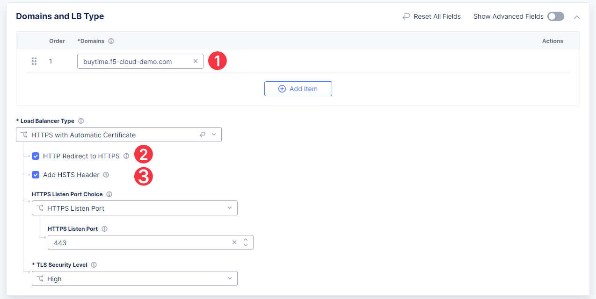
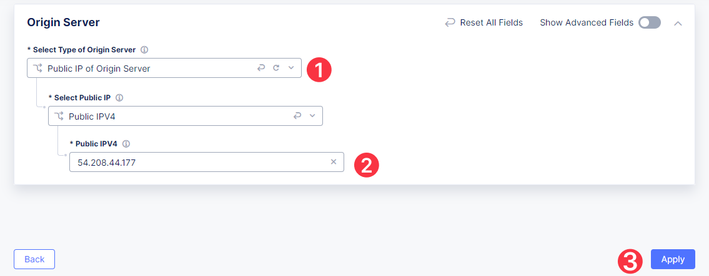
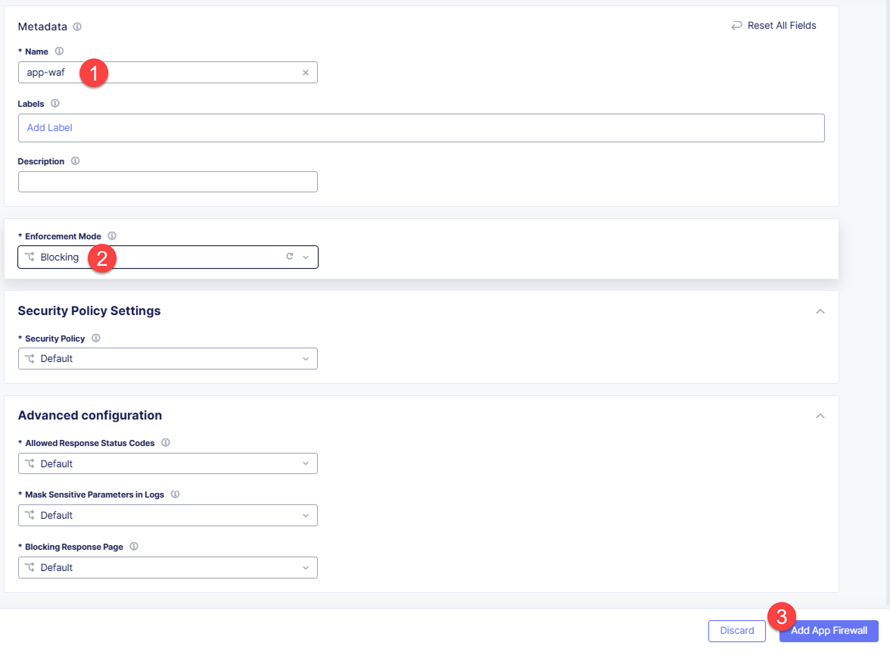
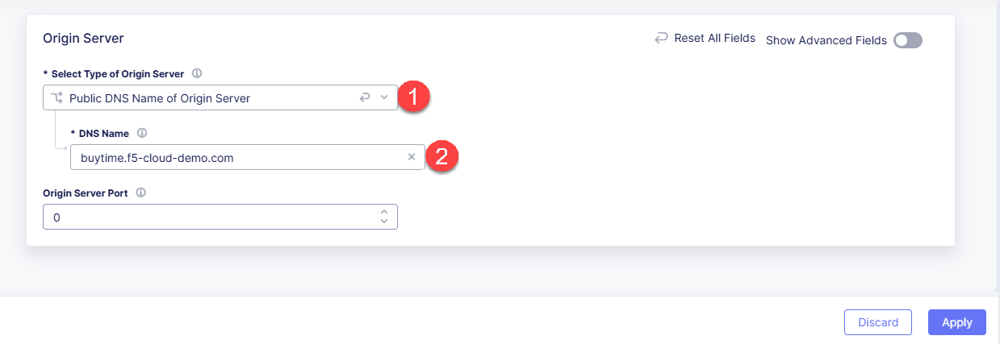
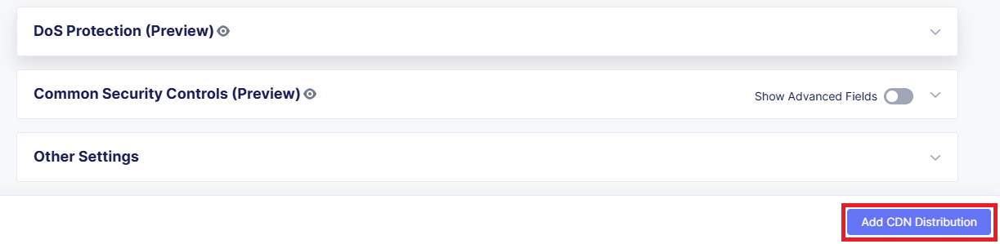

# F5 Distributed Cloud CDN with WAAP

---

## Table of Contents

- [F5 Distributed Cloud CDN with WAAP](#f5-distributed-cloud-cdn-with-waap)
  - [Table of Contents](#table-of-contents)
  - [Objective](#objective)
  - [Pre-requisites](#pre-requisites)
  - [Create HTTP Load Balancer with Web Application Firewall](#create-http-load-balancer-with-web-application-firewall)
  - [Create Content Delivery Network](#create-content-delivery-network)
  - [Test CDN](#test-cdn)
  - [Automated Config of the Demo Environment Configuration via Ansible](#automated-config-of-the-demo-environment-configuration-via-ansible)
  - [Wrap-Up](#wrap-up)

## Objective

Use this guide and the provided sample app to explore F5 Distributed Cloud CDN from the lens of **Application Delivery** and **Application Security**, specifically the **Web Application and API Protection** (WAAP) solution area. The guide will showcase **F5 Distributed Cloud Content Delivery Network** capabilities with **F5 Distributed Cloud App Connect** and **F5 Distributed Cloud WAF** to protect the app. In the course of this guide, we will become familiar with the following features:

- HTTP Load Balancer with WAF protection
- CDN configuration 
- App protection via CDN 

This guide can be completed step-by-step using the F5 Distributed Cloud Console, or you can leverage automatic configuration via the included [Ansible scripts](ansible/).

## Pre-requisites

- F5 Distributed Cloud Console account
- A web browser to access the Console, test the app, and use the developer tools to test load time with / without CDN
  
For Ansible configuration:
- Linux-based system (or on Windows run Windows Subsystem for Linux) with configured Ansible binaries - follow the [Ansible section](ansible/) of the guide.

## Create HTTP Load Balancer with Web Application Firewall

First, we will need to create and configure an HTTP Load Balancer for our app. We will enable redirect to HTTPS and then create an origin pool for the services. Origin pools consist of endpoints and clusters, as well as routes and advertising policies that are required to make the application available to the internet. After that, we will enable and configure the WAF for the HTTP Load Balancer. 

To start with, navigate to the **Multi-Cloud App Connect** service in the service menu.

Select **Load Balancers** and then proceed to **HTTP Load Balancers**. Click the **Add HTTP Load Balancer** button to open the form of HTTP Load Balancer creation.

Then give it a name and move on to domain configuration.

Next, we need to provide a domain name for our workload: a domain can be delegated to F5, so that Domain Name Service (DNS) entries can be created quickly in order to deploy and route traffic to our workload within seconds. In this demo, we use **buytime.f5-cloud-demo.com**. Enable HTTP redirecting to HTTPS, as well as adding the HSTS Header. 

After that, let's create a new origin pool, which will be used in our load balancer. The origin pools are a mechanism to configure a set of endpoints grouped together into a resource pool that is used in the load balancer configuration. Click **Add Item** to open the pool creation form.

Then open the drop-down menu and click **Add Item**.

To configure the origin pool, we'll add a pool name, followed by a set of configuration options for the pool. First, let's give this pool a name.

Now click **Add Item** to start configuring an origin server.

Let's now configure the origin server. First, open the drop-down menu to specify the type of origin server. For this demo, select **Public IP of Origin Server**. Then specify the Public IP - **54.208.44.177**. Complete by clicking **Apply**.

Next, we need to configure the port (the endpoint service/workload available on this port). Type in **80** and click **Add Origin Pool**.

Once done, click **Apply** to apply the origin pool to the Load Balancer configuration. This will return you to the Load Balancer configuration form.

In the **Web Application Firewall** section, first enable **Web Application Firewall** in the drop-down menu, and then click **Add Item** to configure a new WAF object.

First, give the firewall a name. Then specify the enforcement mode in the dropdown menu. The default is Monitoring, meaning that the Distributed Cloud WAF service won't block any traffic but will alert on any request that is found to be violating the WAF policy. Blocking mode means that the Distributed Cloud WAF will take mitigation action on offending traffic. Select **Blocking** and click **Add App Firewall**.

Click **Add HTTP Load Balancer** to save the HTTP Load Balancer settings.

Now we need to copy the hostname. Open the menu of the HTTP Load Balancer we've just created and select **Manage Configuration**.

Copy the hostname you see in the configuration. The hostname will be used as the CNAME value for the domain. After copying the hostname, move on and copy the CNAME value. It will be used to create an HTTPS certificate.

**NOTE:** You can skip these steps if you have [delegated your DNS domain](https://docs.cloud.f5.com/docs/how-to/app-networking/domain-delegation) to F5® Distributed Cloud Services.

Edit your DNS Zone and create new CNAME records. To do that, go to the **DNS Management** service and proceed to **DNS Management**. Select **Manage Configuration** in the DNS Zone service menu.

It may take a few minutes to update the DNS information and generate and apply the certificate. You will see that the certificate is valid as shown in the picture below:

## Create Content Delivery Network

Let's now create high-performance content delivery via the F5 Global Network. Distributed Cloud CDN improves content delivery across environments, providing integrated security with support for content caching and containerized edge-based workloads for richer digital experiences. 

Open the service menu and select **Content Delivery Network**.

Navigate to **CDN Distributions** and click the **Add CDN Distribution** button. 

First, give it a name, then fill in the domain with the CDN indication - **buytime-cdn.f5-cloud-demo.com**. Finally, enable HTTP redirect to HTTPS and add the HSTS Header. 

Let's now create a pool for the CDN. Scroll down to the **CDN Origin Pool** section and click **Configure**.

Type in the DNS name **buytime.f5-cloud-demo.com** and click **Add Item** to add an origin server.

In the dropdown menu, select **Public DNS Name of Origin Server** to fill in the **buytime.f5-cloud-demo.com** DNS name. Then click **Apply**.

Take a look at the CDN Origin Pool configuration and complete it by clicking **Apply**.

You will see the CDN configuration. Click **Add CDN Distribution** to save the configuration and proceed.

You can see the CDN we just created. Now that we've created a CDN, we need to activate the certificate by specifying DNS records. Open the configuration menu and select **Manage Configuration**.

**NOTE:** You can skip these steps if you [delegated your DNS domain](https://docs.cloud.f5.com/docs/how-to/app-networking/domain-delegation) to F5® Distributed Cloud Services.

Copy the CNAME value for the domain and service domain. 

Create corresponding records in your DNS Zone. Go to the **DNS Management** service and proceed to **DNS Management**. Select **Manage Configuration** in the DNS Zone service menu.

You will see the created CDN with a valid certificate. Let's move on and test the app. 

## Test CDN

First, let's test the app without CDN added. As you can see in the picture below, the load time is 2.04 s.

Now let's see the load time for the app with the CDN. As you can see in the picture below, the load time for the CDN app is 1.17 s, and the **x-cache-status** is **HIT**, which means that your request was served by the CDN, not the origin servers.

Now we will attack the app to see that the attacks are blocked by the WAAP services in the CDN. 

In case of content updates on your origin servers, you can force the CDN servers to fetch the updated content using the purge option. Open the configuration menu of the CDN and select **Purge CDN Cache**. The CDN service initiates a purge for all the cache servers.

## Automated Config of the Demo Environment Configuration via Ansible

Follow the README in the [Ansible scripts](ansible/) directory to set up the environment and the demo. You will need to configure the required Ansible Galaxy collections, tokens, and also update the playbook.yaml section at the beginning of the playbook that captures F5 Distributed Cloud environment settings.

Once configured, we recommend you review the *playbook.yaml* sections and pick those you'd like to run (such as environment setup), and comment out the rest. Of course, you can choose to run the entire playbook -- that will go through and do all of the setup & demo configuration steps automatically from beginning to end.

## Wrap-Up

At this stage, you should have set up a CDN for your app. You've configured and applied high-performance content delivery via the F5 Global Network with integrated security and support for content caching. 

We hope you have a better understanding of F5 Distributed Cloud CDN and are now ready to implement it for your own organization. Should you have any issues or questions, please feel free to raise them via GitHub. Thank you!
