F5 Distributed Cloud WAAP CDN GUIDE
######################################

==================================================

.. contents:: Table of Contents

Objective
####################

Use this guide and the provided sample app to explore the F5 Distributed Cloud Content Delivery Network capabilities. This will help you get familiar with the following features & capabilities:

- HTTP Load Balancer with WAF protection
- CDN configuration 
- App protection via CDN 

.. figure:: assets/overview.gif

This guide can be completed step-by-step using the F5 Distributed Cloud console, or leverage automatic configuration via included `Ansible scripts </ansible>`_.

Pre-requisites
##############

- F5 Distributed Cloud Account
- A Web browser to access the F5 Distributed Cloud console, attack the app and see the developer tools to test load time with / without CDN
  
For Ansible configuration:
- Linux-based system (or on Windows run the Subsystem For Linux) with configured Ansible binaries - follow the Ansible section of the guide

Create HTTP Load Balancer with Web Application Firewall
#######################################################

First, we will need to create and configure an HTTP Load Balancer for our app. We will enable redirect to HTTPS and then create an origin pool for the services. Origin pools consist of endpoints and clusters, as well as routes and advertising policies that are required to make the application available to the internet. After that, we will enable and configure WAF for HTTP Load Balancer. 

To start with, navigate to the **Multi-Cloud App Connect** service in the service menu.

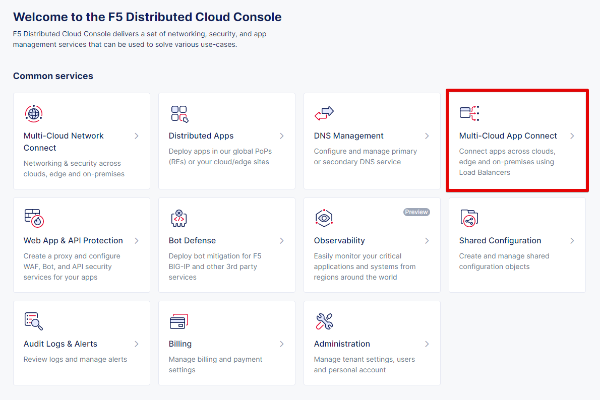

Select **Load Balancers** and then proceed to **HTTP Load Balancers**. Click the **Add HTTP Load Balancer** button to open the form of HTTP Load Balancer creation.

.. figure:: assets/lb_open.png

Then give it a name and move on to domain configuration.

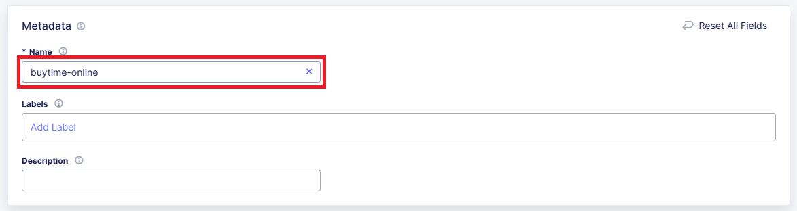

Next we need to provide a domain name for our workload: a domain can be delegated to F5, so that Domain Name Service (DNS) entries can be created quickly in order to deploy and route traffic to our workload within seconds. In this demo we specify **buytime.f5-cloud-demo.com**. And enable HTTP redirecting to HTTPS, as well as adding HSTS Header. 

.. figure:: assets/lb_domain_ssl.png

After that let's create a new origin pool, which will be used in our load balancer. The origin pools are a mechanism to configure a set of endpoints grouped together into a resource pool that is used in the load balancer configuration. Click **Add Item** to open the pool creation form.

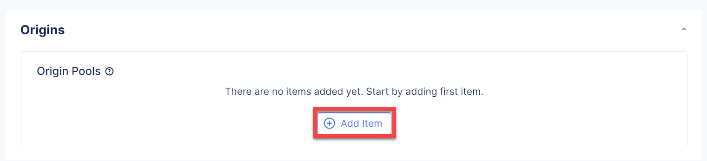

Then open the drop-down menu and click **Add Item**.

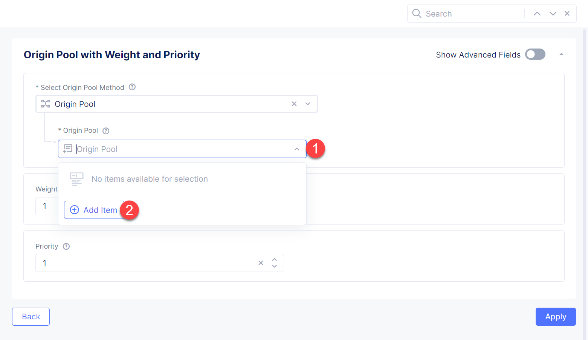

To configure the origin pool we'll add a pool name, followed by a set of config options for the pool. First, let's give this pool a name.

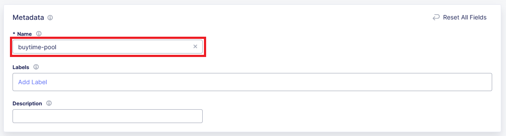

Now click **Add Item** to start configuring an origin server.

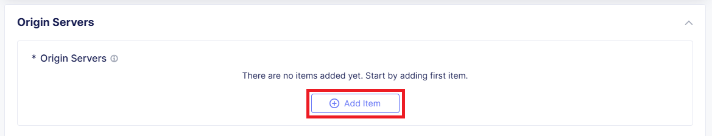

Let's now configure origin server. First open the drop-down menu to specify the type of origin server. For this demo select **Public IP of Origin Server**. Then specify the Public IP - **54.208.44.177**. Complete by clicking **Apply**.

.. figure:: assets/lb_add_origin_5.png

Next we need to configure the port (the end point service/workload available on this port). In this demo it's Port **80**.

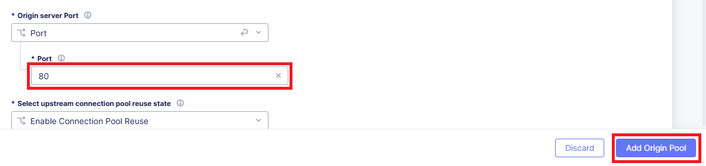

Then just click **Continue** to move on.

Once done, click **Apply** to apply the origin pool to the Load Balancer configuration. This will return to the Load Balancer configuration form.

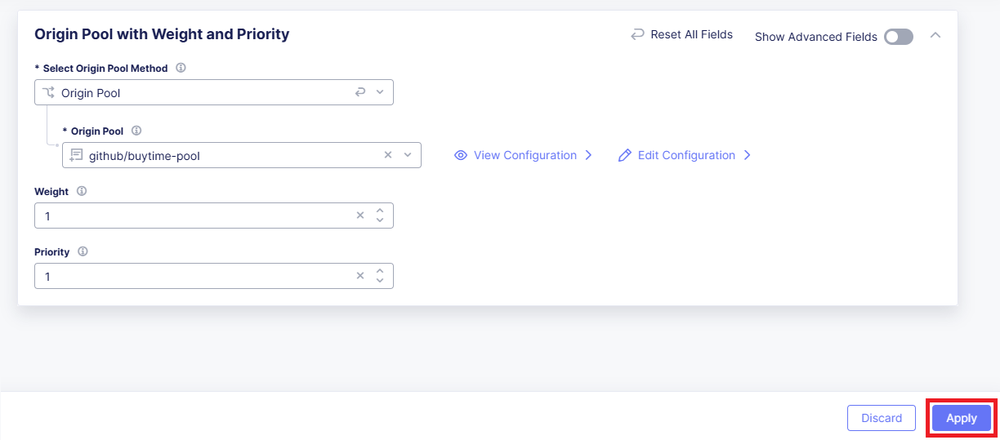

In the **Web Application Firewall** section first enable **Web Application Firewall** in the drop-down menu, and then click **Add Item** to configure a new WAF object.

.. figure:: assets/lb_add_waf_1.png

First, give the Firewall a name. Then specify enforcement mode in the dropdown menu. The default is Monitoring, meaning that the Distributed Cloud WAF service won't block any traffic but will alert on any request that is found to be violating the WAF policy. Blocking mode means that the Distributed Cloud WAF will take mitigation action on offending traffic. Select the **Blocking mode** option and click **Continue**.

.. figure:: assets/lb_add_waf_2.png

Click **Save and Exit** to save the HTTP Load Balancer settings.

.. figure:: assets/lb_save.png

Now we need to copy the host name. Open the menu of HTTP Load Balancer we've just created and select **Manage Configuration**.

.. figure:: assets/lb_dns_1.png

Copy the host name you see in the configuration. Host name will be used as CNAME value for the domain. After copying the host name, move on and copy CNAME value. It will be used to create an HTTPS certificate.

NOTE: You can skip these steps if you have `delegated your DNS domain <https://docs.cloud.f5.com/docs/how-to/app-networking/domain-delegation>`_ to F5® Distributed Cloud Services.

.. figure:: assets/lb_dns_2.png

Edit your DNS Zone and create new CNAME records.

.. figure:: assets/lb_dns_3.png

.. figure:: assets/lb_dns_4.png

It may take a few minutes to update the DNS info and generate and apply the certificate. You will see that the certificate is valid as in the picture below:

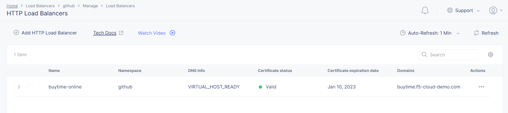

Create Content Delivery Network
##############################

Let's now create a high-performance content delivery via the F5 global network. F5 Distributed Cloud CDN improves content delivery across environments providing integrated security with support for content caching and containerized edge-based workloads for richer digital experiences. 

Open the service menu and select **Content Delivery Network**.

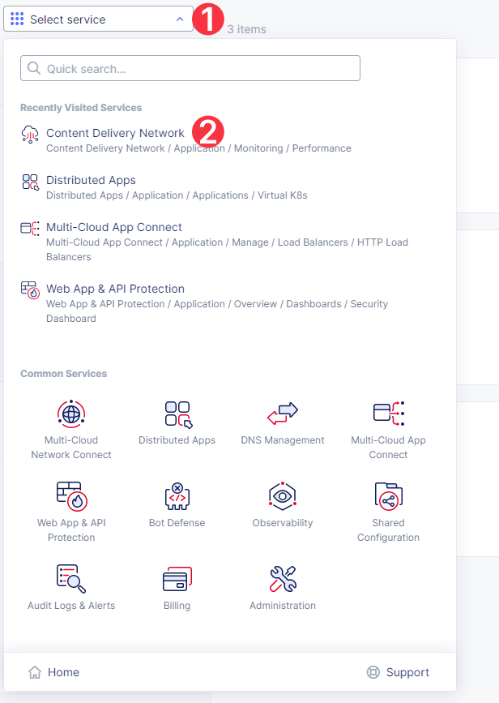

Navigate to **Distributions** and click the **Add Distribution** button. 

.. figure:: assets/cdn_create_1.png

First, give it a name, then fill in the domain with the CDN indication - **buytime-cdn.f5-cloud-demo.com**. And finally, enable HTTP redirect to HTTPS and adding HSTS Header. 

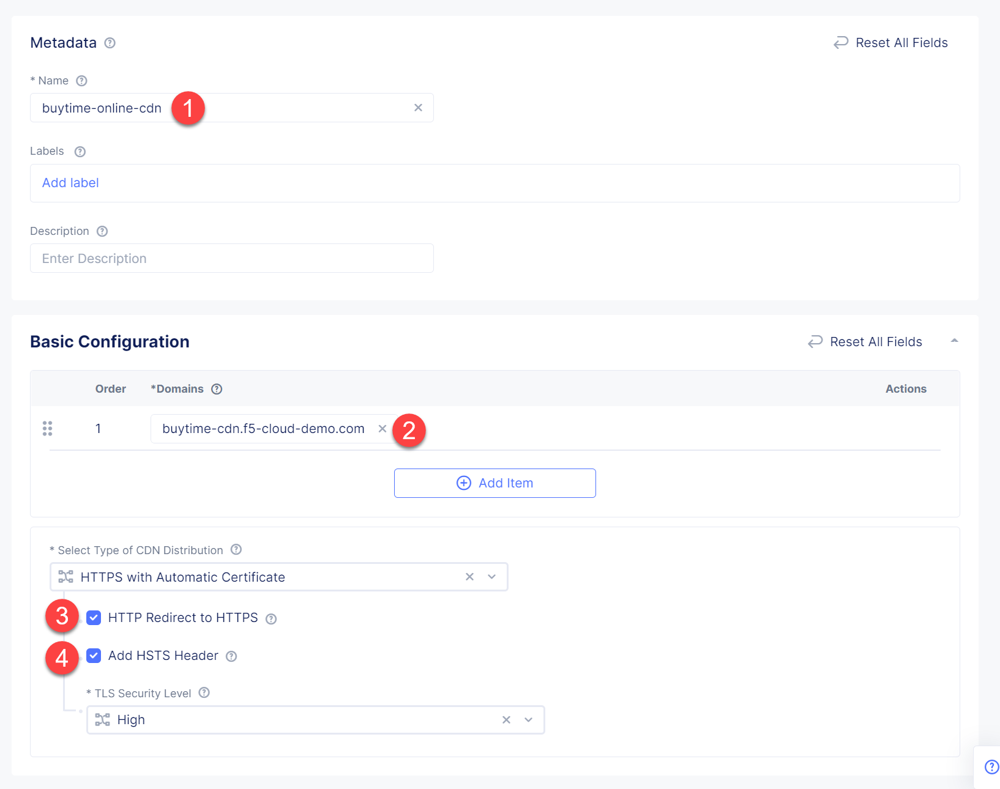

Let's now create a pool for CDN. Scroll down to the **CDN Origin Pool** section and click **Configure**.

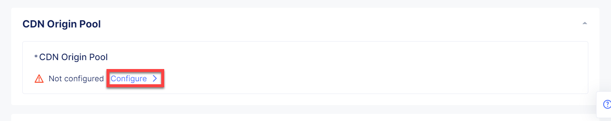

Type in the DNS name **buytime.f5-cloud-demo.com** and click **Add Item** to add an origin server.

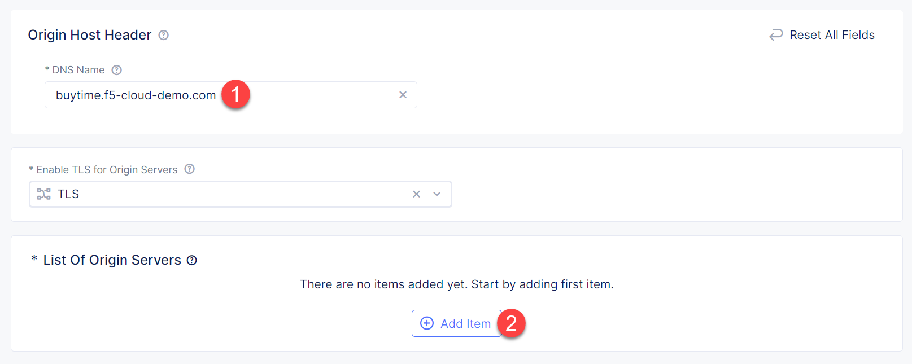

In the dropdown menu select **Public DNS Name of Origin Server** to fill in the **buytime.f5-cloud-demo.com**  DNS name. Then click **Apply**.

.. figure:: assets/cdn_create_5.png

Take a look at the CDN Origin Pool configuration and complete by clicking **Apply**.

.. figure:: assets/cdn_create_6.png

You will see the CDN configuration. Click **Save and Exit** to save the configuration and proceed.

.. figure:: assets/cdn_create_7.png

You can see the CDN we just created. Now that we've created a CDN, we can need to activate the certificate by specifying DNS records. Open the configuration menu and select **Manage Configuration**.

NOTE: You can skip these steps if you `delegated your DNS domain <https://docs.cloud.f5.com/docs/how-to/app-networking/domain-delegation>`_ to F5® Distributed Cloud Services.

.. figure:: assets/cdn_dns_1.png

Copy the CNAME value for the domain and service domain. 

.. figure:: assets/cdn_dns_2.png

Create corresponding records in your DNS Zone. 

.. figure:: assets/cdn_dns_3.png

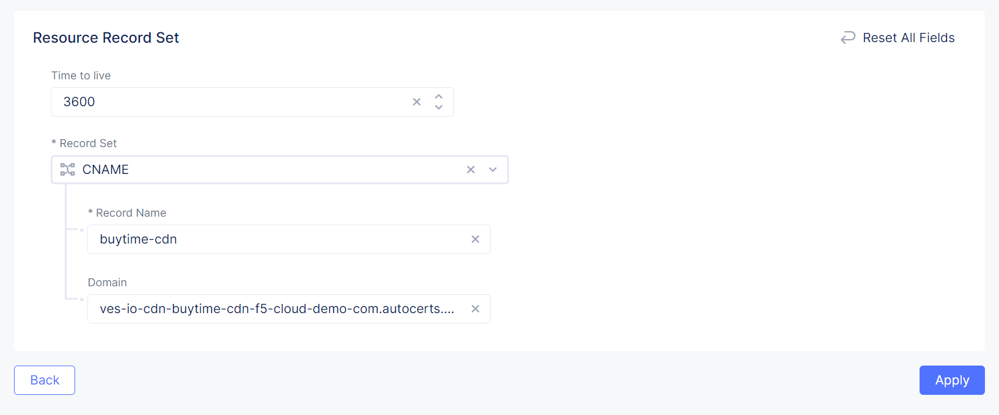

You will see the created CDN with the valid certificate. Let's move on and test the app. 

.. figure:: assets/cdn_dns_5.png

Test CDN 
########

First, let's test the app without the CDN added. As you can see in the picture below, load time is 2.04 s.

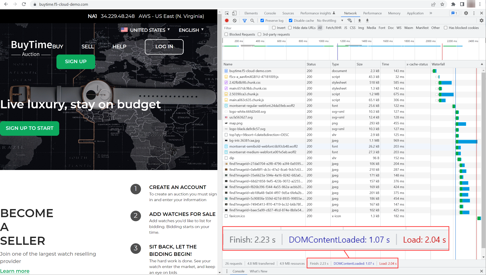

Now let's see the load time for the app with CDN. As you can see in the picture below, the load time for CDN app is 1.17 s, and the **x-cache-status** is **HIT** which means that your request was served by CDN, not origin servers.

.. figure:: assets/tests_cdn.png

Now we will attack the app to see that the attacks are blocked by WAAP services in CDN. 

.. figure:: assets/test_cdn_waap.png

In case of content updates in your origin servers, you can force the CDN servers to fetch the updated content using the purge option. Open the configuration menu of the CDN and select **Purge**. The CDN service initiates purge for all the cache servers.

.. figure:: assets/cdn_purge.png

Automated Config of the Demo Environment Configuration via Ansible
###################################################################

Follow the README in the `Ansible scripts </ansible>`_ directory to set up the environment and the demo. You will need to configure the required Ansible Galaxy collections, tokens, and also update the playbook.yaml section in the beginning of the playbook that captures F5 Distributed Cloud environment settings.

Once configured, we recommend you review *playbook.yaml* sections, and pick those you'd like to run (such as environment setup), and comment out the rest. Of course, you can choose to run the entire playbook -- that will go through and do all of the setup & demo config steps automatically from beginning to end.

Wrap-Up
#######

At this stage you should have set up a Content Delivery Network (CDN) for your app. You've configured and applied high-performance content delivery via the F5 global network with integrated security and support for content caching. 

We hope you have a better understanding of F5 Distributed Cloud CDN and are now ready to implement it for your own organization. Should you have any issues or questions, please feel free to raise them via GitHub. Thank you!
