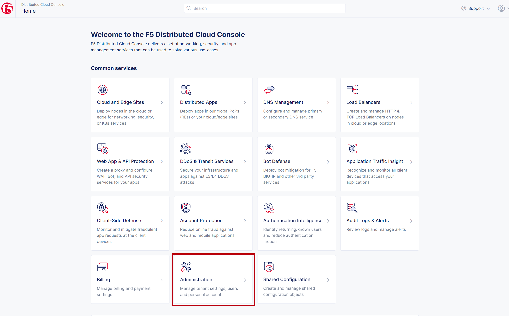
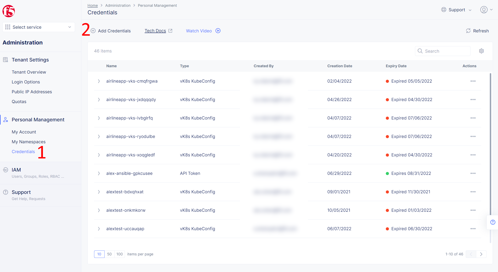
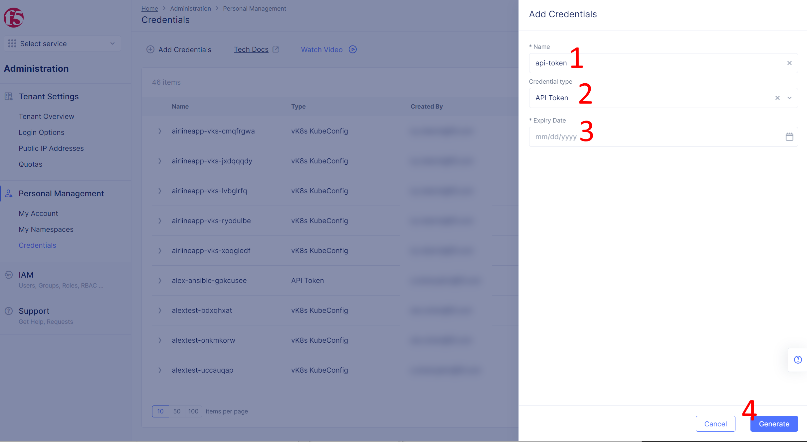
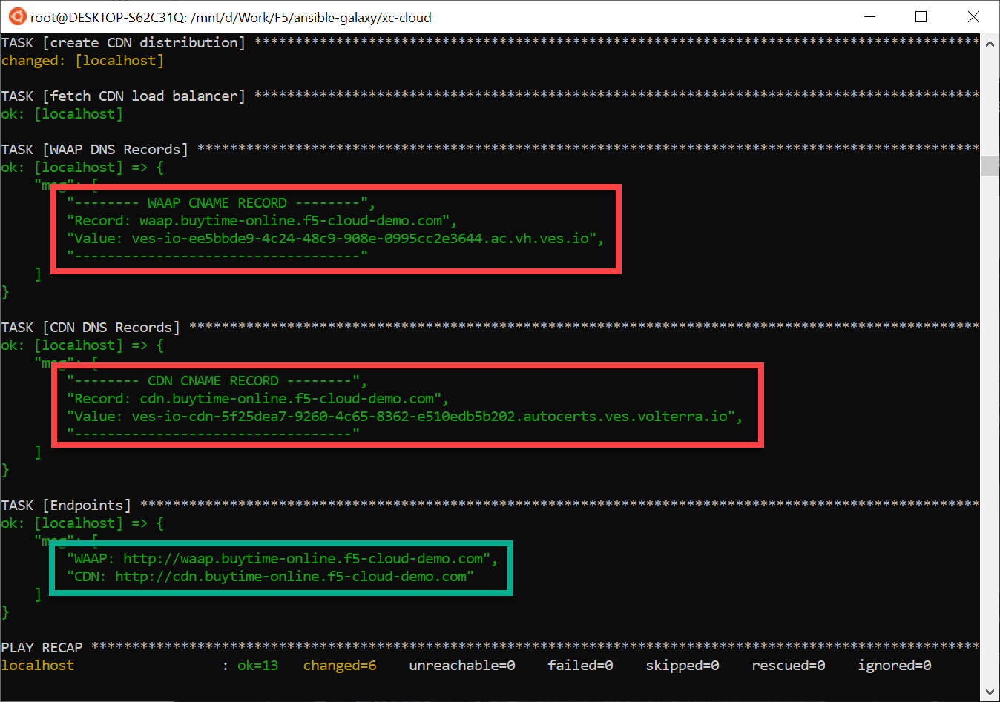

Installation Instructions
------------ 

Install Ansible Galaxy collections and Python dependencies:
 
```shell
  ansible-galaxy collection install yoctoalex.xc_cloud_modules
  ansible-galaxy collection install kubernetes.core
  pip3 install kubernetes
```

Create an API Token. Navigate to the **Administration** page.
  

  
Then open the **Credentials** tab and click **Add Credentials**
  


Fill in the details and click the **Generate** button
    


Copy the generated token to the Ansible script in the environments section. 
Here you can also configure your domain, namespace, tenant, app prefix, etc.

The solution contains two configurations:
- **waap-cdn-https.yaml** for HTTPS with Auto Cert
- **waap-cdn-http.yaml** for HTTP
    
Both configurations support [F5 Distributed Cloud Domain Delegation](https://docs.cloud.f5.com/docs/how-to/app-networking/domain-delegation). To enable, set **dns_volterra_managed** to **True**. 

```yaml
  environment:
      XC_API_TOKEN: "your_api_token"
      XC_TENANT: "your_tenant_name.console.ves.volterra.io"
      
  vars:
      namespace: "cdn-demo-guide"
      prefix: ""
      domain: "your_domain.example.com"
      dns_volterra_managed: False
```

Execute the Ansible script with the following command:

```shell
  ansible-playbook waap-cdn-http.yaml -i ./hosts
```

Check the output and create the corresponding CNAME records on your DNS server. You can also find the created endpoints to access the website.


